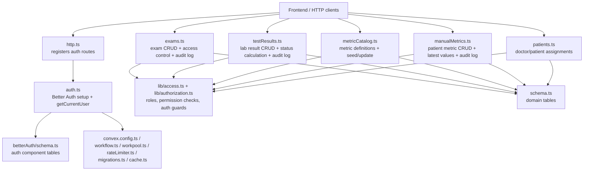
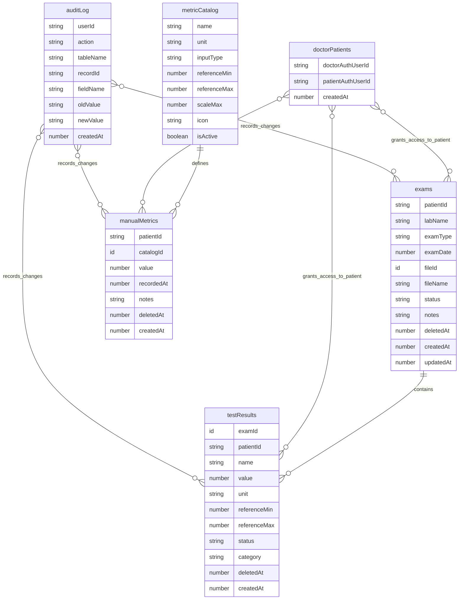

# Convex Backend Overview

This document describes the current handwritten TypeScript code in `packages/backend/convex`, what each file does, which tests cover it today, and the current database structure defined in Convex.

It is based on the source as it exists now, especially:

- [schema.ts](/Users/cmontedonico/repos/chopo/packages/backend/convex/schema.ts)
- [auth.ts](/Users/cmontedonico/repos/chopo/packages/backend/convex/auth.ts)
- [betterAuth/schema.ts](/Users/cmontedonico/repos/chopo/packages/backend/convex/betterAuth/schema.ts)
- the test files under [__tests__](/Users/cmontedonico/repos/chopo/packages/backend/convex/__tests__)

## High-Level Map

## File-By-File Guide

### Runtime and config files

| File | What it does | Current test coverage |
| --- | --- | --- |
| [convex.config.ts](/Users/cmontedonico/repos/chopo/packages/backend/convex/convex.config.ts) | Declares the Convex app and mounts the Better Auth, migrations, rate limiter, workflow, and workpool components. | No direct tests. |
| [http.ts](/Users/cmontedonico/repos/chopo/packages/backend/convex/http.ts) | Creates the HTTP router and registers Better Auth routes with CORS enabled. | No direct tests. |
| [auth.config.ts](/Users/cmontedonico/repos/chopo/packages/backend/convex/auth.config.ts) | Exposes the Convex auth provider config used by Better Auth. | No direct tests. |
| [auth.ts](/Users/cmontedonico/repos/chopo/packages/backend/convex/auth.ts) | Builds Better Auth options, wires the admin plugin roles, and exposes `getCurrentUser` so the frontend can read auth state including `banned`. | No direct tests. |
| [healthCheck.ts](/Users/cmontedonico/repos/chopo/packages/backend/convex/healthCheck.ts) | Simple health query that returns `"OK"`. | No direct tests. |
| [privateData.ts](/Users/cmontedonico/repos/chopo/packages/backend/convex/privateData.ts) | Example protected query gated by `requireAuth`. | No direct tests. |
| [migrations.ts](/Users/cmontedonico/repos/chopo/packages/backend/convex/migrations.ts) | Instantiates the migrations component and exports the runner. | No direct tests. |
| [rateLimiter.ts](/Users/cmontedonico/repos/chopo/packages/backend/convex/rateLimiter.ts) | Defines named rate-limit buckets for failed logins, API requests, and sign-ups. | No direct tests. |
| [workflow.ts](/Users/cmontedonico/repos/chopo/packages/backend/convex/workflow.ts) | Configures the workflow manager and retry behavior. | No direct tests. |
| [workpool.ts](/Users/cmontedonico/repos/chopo/packages/backend/convex/workpool.ts) | Configures the default work pool and retry behavior. | No direct tests. |
| [cache.ts](/Users/cmontedonico/repos/chopo/packages/backend/convex/cache.ts) | Re-exports `ActionCache` for action-level caching. | No direct tests. |

### Domain modules

| File | Main exports | What it does | Current test coverage |
| --- | --- | --- | --- |
| [exams.ts](/Users/cmontedonico/repos/chopo/packages/backend/convex/exams.ts) | `create`, `update`, `softDelete`, `listByPatient`, `getById` | Handles patient exam records, enforces patient/doctor/super-admin access, implements soft delete, and writes audit log entries for create/update/delete. | Covered by [exams.test.ts](/Users/cmontedonico/repos/chopo/packages/backend/convex/__tests__/exams.test.ts). |
| [testResults.ts](/Users/cmontedonico/repos/chopo/packages/backend/convex/testResults.ts) | `createBatch`, `update`, `softDelete`, `listByExam`, `listByPatient`, `getByPatientAndName`, `getByCategory`, `getStatus` | Stores parsed lab results tied to exams, derives result status from reference ranges, enforces access control, supports soft delete, and writes audit entries. | Partially covered by [testResults.test.ts](/Users/cmontedonico/repos/chopo/packages/backend/convex/__tests__/testResults.test.ts). |
| [metricCatalog.ts](/Users/cmontedonico/repos/chopo/packages/backend/convex/metricCatalog.ts) | `list`, `seed`, `update` | Defines the default set of manual metrics, exposes active catalog listing, seeds missing defaults, and lets super admins toggle/update reference ranges. | Covered by [metricCatalog.test.ts](/Users/cmontedonico/repos/chopo/packages/backend/convex/__tests__/metricCatalog.test.ts). |
| [manualMetrics.ts](/Users/cmontedonico/repos/chopo/packages/backend/convex/manualMetrics.ts) | `create`, `update`, `softDelete`, `listByPatient`, `listByPatientAndCatalog`, `getLatestByPatient` | Stores patient-entered metrics linked to the catalog, validates scale metrics, enforces access control, supports soft delete, and provides a latest-value summary by catalog. | Covered by [manualMetrics.test.ts](/Users/cmontedonico/repos/chopo/packages/backend/convex/__tests__/manualMetrics.test.ts). |
| [patients.ts](/Users/cmontedonico/repos/chopo/packages/backend/convex/patients.ts) | `assignToDoctor`, `removeFromDoctor`, `listByDoctor`, `listAssignedPatientIds` | Manages the `doctorPatients` relation that powers doctor access to patient records. | No direct tests. |
| [schema.ts](/Users/cmontedonico/repos/chopo/packages/backend/convex/schema.ts) | default schema export | Defines the application tables and indexes for exams, results, manual metrics, doctor assignments, and audit logs. | Indirectly exercised by module tests, but not tested directly. |

### Auth and support libraries

| File | What it does | Current test coverage |
| --- | --- | --- |
| [lib/access.ts](/Users/cmontedonico/repos/chopo/packages/backend/convex/lib/access.ts) | Declares Better Auth access-control resources and the `super_admin`, `user`, and `doctor` role statements. | No direct tests. |
| [lib/authorization.ts](/Users/cmontedonico/repos/chopo/packages/backend/convex/lib/authorization.ts) | Reads the current user from Better Auth, blocks banned users, and provides `requireAuth`, `requireRole`, `checkPermission`, and `requirePermission`. | No direct tests. In some tests it is mocked instead of exercised. |

### Better Auth component files

| File | What it does | Current test coverage |
| --- | --- | --- |
| [betterAuth/schema.ts](/Users/cmontedonico/repos/chopo/packages/backend/convex/betterAuth/schema.ts) | Defines the Better Auth component tables: `user`, `session`, `account`, `verification`, and `jwks`, plus admin-plugin fields like `role` and `banned`. | No direct tests. |
| [betterAuth/adapter.ts](/Users/cmontedonico/repos/chopo/packages/backend/convex/betterAuth/adapter.ts) | Generates CRUD helpers from the Better Auth schema and auth options. | No direct tests. |
| [betterAuth/auth.ts](/Users/cmontedonico/repos/chopo/packages/backend/convex/betterAuth/auth.ts) | Exports a Better Auth instance for the component. | No direct tests. |
| [betterAuth/convex.config.ts](/Users/cmontedonico/repos/chopo/packages/backend/convex/betterAuth/convex.config.ts) | Declares the Convex component named `betterAuth`. | No direct tests. |

### Generated files

These are present in the folder but are generated artifacts, not handwritten business logic:

- `_generated/api.d.ts`
- `_generated/api.js`
- `_generated/dataModel.d.ts`
- `_generated/server.d.ts`
- `_generated/server.js`
- `betterAuth/_generated/*`

They should generally not be documented as owned application logic, and one of them currently shows as modified in git:

- `packages/backend/convex/_generated/api.d.ts`

## Domain Behavior Notes

### Exams

Key behavior in [exams.ts](/Users/cmontedonico/repos/chopo/packages/backend/convex/exams.ts):

- `create` allows regular users to create exams only for themselves, while `super_admin` can create on behalf of a specific patient.
- `update` only patches changed mutable fields and writes one audit row per changed field.
- `softDelete` marks `deletedAt` and keeps the record.
- `listByPatient` uses the `by_patient_date` index and returns active exams ordered newest first.
- `getById` hides unauthorized access by returning `null` instead of leaking record existence.

### Test results

Key behavior in [testResults.ts](/Users/cmontedonico/repos/chopo/packages/backend/convex/testResults.ts):

- `createBatch` validates category values against a hard-coded set and computes `status` with `getStatus`.
- `update` recalculates `status` whenever `value`, `referenceMin`, or `referenceMax` changes.
- Reads are scoped by patient access, including doctor-to-patient assignment checks.
- `getByPatientAndName` returns chronological history for a given test name.
- `getByCategory` queries the category index first, then filters in memory by patient.

### Metric catalog and manual metrics

Key behavior in [metricCatalog.ts](/Users/cmontedonico/repos/chopo/packages/backend/convex/metricCatalog.ts) and [manualMetrics.ts](/Users/cmontedonico/repos/chopo/packages/backend/convex/manualMetrics.ts):

- `metricCatalog.seed` inserts the 15 default metrics if missing and is intentionally idempotent.
- `manualMetrics.create` only accepts active catalogs and enforces bounds for `scale` metrics.
- `manualMetrics.getLatestByPatient` returns one summary row per active catalog, even if the patient has no readings yet.
- Soft deletion is used in manual metrics too; records stay in the table and are filtered out in queries.

### Doctor/patient assignment model

[patients.ts](/Users/cmontedonico/repos/chopo/packages/backend/convex/patients.ts) is the small but important module that controls access delegation:

- `assignToDoctor` inserts into `doctorPatients` if the pair does not already exist.
- `removeFromDoctor` deletes the existing pair if present.
- `listByDoctor` returns all assignments for `super_admin`, or only self assignments for `doctor`.
- `listAssignedPatientIds` returns patient IDs for doctors and super admins, but an empty list for normal users.

This table is referenced by `exams.ts`, `manualMetrics.ts`, and `testResults.ts` to decide whether a doctor may access a patient.

## Current Test Coverage

### Covered well

The following modules have dedicated unit-style coverage:

- [exams.test.ts](/Users/cmontedonico/repos/chopo/packages/backend/convex/__tests__/exams.test.ts)
  - `create` normal user flow
  - `create` super admin flow
  - missing `patientId` validation for super admin
  - partial update behavior and per-field audit rows
  - soft-delete behavior and idempotency
  - list filtering and ordering
  - not-found masking for unauthorized access
  - doctor-assigned read access
- [metricCatalog.test.ts](/Users/cmontedonico/repos/chopo/packages/backend/convex/__tests__/metricCatalog.test.ts)
  - default seed count and idempotency
  - active-only listing sorted by name
  - deactivate/update flow
- [manualMetrics.test.ts](/Users/cmontedonico/repos/chopo/packages/backend/convex/__tests__/manualMetrics.test.ts)
  - active catalog validation
  - scale max enforcement
  - create/update audit logging
  - soft delete filtering
  - latest-by-patient aggregation
  - doctor-assigned read access
- [testResults.test.ts](/Users/cmontedonico/repos/chopo/packages/backend/convex/__tests__/testResults.test.ts)
  - `getStatus` thresholds
  - batch creation with derived status
  - update status recalculation
  - soft delete filtering
  - patient history by test name

### Not covered or only partially covered

- [patients.ts](/Users/cmontedonico/repos/chopo/packages/backend/convex/patients.ts): no direct tests.
- [auth.ts](/Users/cmontedonico/repos/chopo/packages/backend/convex/auth.ts): no direct tests for Better Auth config or `getCurrentUser`.
- [lib/authorization.ts](/Users/cmontedonico/repos/chopo/packages/backend/convex/lib/authorization.ts): no direct tests; it is mocked in [exams.test.ts](/Users/cmontedonico/repos/chopo/packages/backend/convex/__tests__/exams.test.ts) and [metricCatalog.test.ts](/Users/cmontedonico/repos/chopo/packages/backend/convex/__tests__/metricCatalog.test.ts).
- [http.ts](/Users/cmontedonico/repos/chopo/packages/backend/convex/http.ts), [rateLimiter.ts](/Users/cmontedonico/repos/chopo/packages/backend/convex/rateLimiter.ts), [workflow.ts](/Users/cmontedonico/repos/chopo/packages/backend/convex/workflow.ts), [workpool.ts](/Users/cmontedonico/repos/chopo/packages/backend/convex/workpool.ts), [migrations.ts](/Users/cmontedonico/repos/chopo/packages/backend/convex/migrations.ts), [cache.ts](/Users/cmontedonico/repos/chopo/packages/backend/convex/cache.ts), [healthCheck.ts](/Users/cmontedonico/repos/chopo/packages/backend/convex/healthCheck.ts), and [privateData.ts](/Users/cmontedonico/repos/chopo/packages/backend/convex/privateData.ts): no direct tests.
- [testResults.ts](/Users/cmontedonico/repos/chopo/packages/backend/convex/testResults.ts): `listByExam`, `listByPatient`, and `getByCategory` exist in runtime code, but the current tests do not fully cover all access-control branches and error paths for them.
- [manualMetrics.ts](/Users/cmontedonico/repos/chopo/packages/backend/convex/manualMetrics.ts): update authorization failure paths and forbidden/nonexistent masking are not explicitly covered.
- [exams.ts](/Users/cmontedonico/repos/chopo/packages/backend/convex/exams.ts): mutation authorization branches are covered better than some other modules, but `listByPatient` denial paths and some operational error branches are still lightly covered.

## Current Database Structure

There are effectively two schema areas:

1. The application schema from [schema.ts](/Users/cmontedonico/repos/chopo/packages/backend/convex/schema.ts)
2. The Better Auth component schema from [betterAuth/schema.ts](/Users/cmontedonico/repos/chopo/packages/backend/convex/betterAuth/schema.ts)

### Application tables

#### Table details and indexes

| Table | Fields | Indexes |
| --- | --- | --- |
| `exams` | `patientId`, `labName`, `examType`, `examDate`, `fileId`, `fileName`, `status`, optional `notes`, optional `deletedAt`, `createdAt`, `updatedAt` | `by_patient`, `by_patient_date`, `by_status` |
| `testResults` | `examId`, `patientId`, `name`, `value`, `unit`, `referenceMin`, `referenceMax`, `status`, `category`, optional `deletedAt`, `createdAt` | `by_exam`, `by_patient`, `by_patient_name`, `by_category` |
| `metricCatalog` | `name`, `unit`, `inputType`, optional `referenceMin`, optional `referenceMax`, optional `scaleMax`, `icon`, `isActive` | `by_name` |
| `manualMetrics` | `patientId`, `catalogId`, `value`, `recordedAt`, optional `notes`, optional `deletedAt`, `createdAt` | `by_patient`, `by_patient_catalog`, `by_patient_date` |
| `doctorPatients` | `doctorAuthUserId`, `patientAuthUserId`, `createdAt` | `by_doctor_patient`, `by_doctor`, `by_patient` |
| `auditLog` | `userId`, `action`, `tableName`, `recordId`, optional `fieldName`, optional `oldValue`, optional `newValue`, `createdAt` | `by_record`, `by_user`, `by_table` |

### Better Auth component tables

These are defined separately in [betterAuth/schema.ts](/Users/cmontedonico/repos/chopo/packages/backend/convex/betterAuth/schema.ts):

| Table | Purpose | Important fields |
| --- | --- | --- |
| `user` | Auth user profile and admin state | `name`, `email`, `emailVerified`, optional `image`, optional `userId`, optional `role`, optional `banned`, optional `banReason`, optional `banExpires`, timestamps |
| `session` | Active sessions | `token`, `userId`, `expiresAt`, optional `ipAddress`, optional `userAgent`, optional `impersonatedBy`, timestamps |
| `account` | Provider account linkage / password storage | `accountId`, `providerId`, `userId`, optional tokens, optional `password`, timestamps |
| `verification` | Verification tokens | `identifier`, `value`, `expiresAt`, timestamps |
| `jwks` | Key storage for token signing | `publicKey`, `privateKey`, `createdAt`, optional `expiresAt` |

## Practical Reading Order

If someone new joins this backend, the fastest reading order is:

1. [schema.ts](/Users/cmontedonico/repos/chopo/packages/backend/convex/schema.ts)
2. [lib/authorization.ts](/Users/cmontedonico/repos/chopo/packages/backend/convex/lib/authorization.ts)
3. [patients.ts](/Users/cmontedonico/repos/chopo/packages/backend/convex/patients.ts)
4. [exams.ts](/Users/cmontedonico/repos/chopo/packages/backend/convex/exams.ts)
5. [testResults.ts](/Users/cmontedonico/repos/chopo/packages/backend/convex/testResults.ts)
6. [metricCatalog.ts](/Users/cmontedonico/repos/chopo/packages/backend/convex/metricCatalog.ts)
7. [manualMetrics.ts](/Users/cmontedonico/repos/chopo/packages/backend/convex/manualMetrics.ts)
8. [auth.ts](/Users/cmontedonico/repos/chopo/packages/backend/convex/auth.ts)

That order mirrors how the access model and the core patient data flows fit together.
